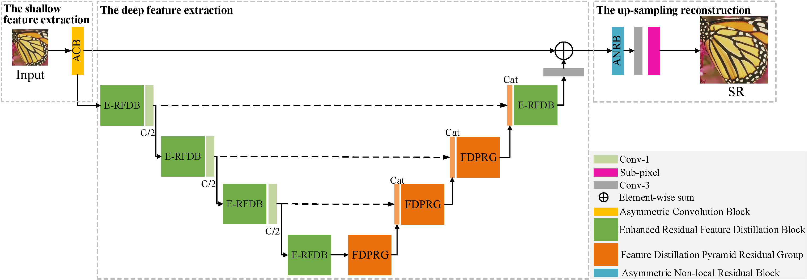

## URNet

This repository is an official PyTorch implementation of the paper **"URNet: An U-shaped Residual Network for Lightweight Image Super-resolution"**

The code is built on [EDSR (PyTorch)](https://github.com/sanghyun-son/EDSR-PyTorch) .


## Introduction

It is extremely important and necessary for low computing power or portable devices to design more lightweight algorithms for image super-resolution (SR). Recently, most SR methods have achieved outstanding performance by sacrificing computational cost and memory storage, or vice versa. To address this problem, we introduce a lightweight U-shaped Residual Network (URNet) for fast and accurate image SR. Specially, we propose a more effective feature distillation pyramid residual group (FDPRG) to extract features from low-resolution images based on the enhanced residual feature distillation block of E-RFDN. The FDPRG can effectively reuse the learned features with dense shortcut connections and capture multi-scale information with a cascaded feature pyramid block. Based on the U-shaped structure, we utilize a step-by-step fusion strategy to improve the performance of feature fusion of different blocks. This strategy is different from the general SR methods which only use a single Concat operation to fuse the features of all basic blocks. Moreover, a lightweight asymmetric residual non-local block is proposed to model the global context information and further improve the performance of SR. Finally, a high-frequency loss function is designed to alleviate the problem of smoothing image details caused by pixel-wise loss. Extensive experiments show the URNet achieves a better trade-off between image SR performance and model complexity against other state-of-the-art SR methods.



URNet architecture.


## Datasets

We use DIV2K dataset for training and Set5, Set14, B100 and Urban100 dataset for the benchmark test.

* Prepare training data

  Download DIV2K training data (800 training + 100 validtion images) from [DIV2K dataset](https://data.vision.ee.ethz.ch/cvl/DIV2K/) 

* Prepare test data

  Test sets  are available from  [benchmark.zip (234M)](https://pan.baidu.com/s/1uI1VNcHBki1ClbkRceX7Zw) [BaiduYun, Password: 1234]

For more informaiton, please refer to [EDSR (PyTorch)](https://github.com/sanghyun-son/EDSR-PyTorch). 


## Quick Start (Demo)

Unpack the tar/zip file to any place you want. Then, change the `dir_data` argument in `src/option.py` to the place where DIV2K/benchmark images are located.

All scripts are provided in the `src/demo.sh`. Note that URNet (x3, x4) requires pre-trained URNet  (x2). You can ignore this constraint by removing `--pre_train <x2 model>` argument.

Run the script in `src` folder. Before you run the demo, please uncomment the appropriate line in `demo.sh` that you want to execute.

```
cd src       # You are now in */URNet/src
sh demo.sh
```


### Test Pretrained Models

We provide the pretrained models in `pre_trained` directory. To test URNet on benchmark dataset:

**You can use scripts in file 'URNet/src' to test models for our paper.**

```shell
# BI, scale 2, 3, 4
# URNet_X2
python main.py --model urn --data_test Set5+Set14+B100+Urban100--scale 2 --pre_train ../pre_trained/urn_x2.pt --test_only --save_results
# URNet_X3
#python main.py --model urn --data_test Set5+Set14+B100+Urban100--scale 3 --pre_train ../pre_trained/urn_x3.pt --test_only --save_results
# URNet_X4
#python main.py --model urn --data_test Set5+Set14+B100+Urban100--scale 4 --pre_train ../pre_trained/urn_x4.pt --test_only --save_results
```


### Train Models

**You can use scripts in file 'URNet/src' to test models for our paper.**

```shell
# URNet model (x2), input=64x64, output=128x128
python main.py --model urn --scale 2 --patch_size 128 --save urn_x2 --loss 1.0*L1+0.25*canny --reset

# URNet model (x3) - from URNet (x2), input=64x64, output=192x192
#python main.py --model urn --scale 3 --patch_size 192 --save urn_x3  --loss 1.0*L1+0.25*canny --reset --pre_train [pre-trained urn_x2model dir]

# URNet model (x4) - from URNet (x2), input=64x64, output=256x256
#python main.py --model urn --scale 4 --patch_size 256 --save urn_x4  --loss 1.0*L1+0.25*canny --reset --pre_train [pre-trained urn_x2 model dir]
```


## Results

| Network  | Parameters |     Set5     |    Set14     |     B100     |   Urban100   |
| :------- | :--------: | :----------: | :----------: | :----------: | :----------: |
| URNet_x2 |    612K    | 38.06/0.9608 | 33.68/0.9187 | 32.24/0.9005 | 32.42/0.9310 |
| URNet_x3 |    621K    | 34.51/0.9281 | 30.40/0.8433 | 29.14/0.8061 | 28.40/0.8574 |
| URNet_x4 |    633K    | 32.20/0.8952 | 28.63/0.7826 | 27.60/0.7369 | 26.23/0.7905 |

We provide our results on four benchmark dataset (Set5, Set14, B100 and Urban100). [URNet_results.zip (381M)](https://pan.baidu.com/s/1-_R0La6UIESqcBnJKnSi3A) [BaiduYun, Password: 1234]


## Acknowledgements

This code is built on [EDSR (PyTorch)](https://github.com/sanghyun-son/EDSR-PyTorch). We thank the authors for sharing their codes of EDSR [Torch version](https://github.com/LimBee/NTIRE2017) and [PyTorch version](https://github.com/sanghyun-son/EDSR-PyTorch).

